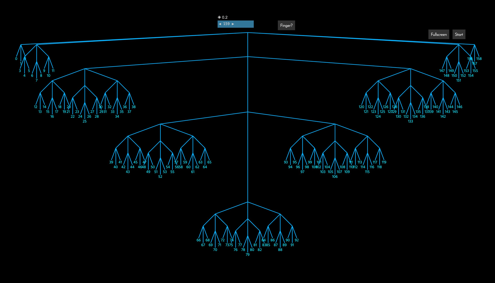
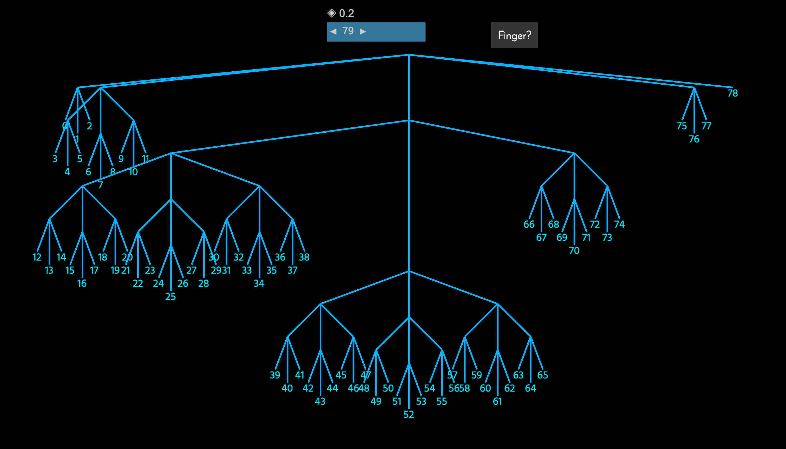

## A Persistent, Structurally-Shared List for the Calcit Runtime

This library implements a variant of a 2-3 tree with ternary branching, also known as a ternary search tree. It is further enhanced with finger-tree-inspired optimizations.

The `pop_left()` and `push_right()` operations are optimized to be amortized `O(1)` in the best cases and `O(log n)` when restructuring is involved.

For a visual explanation of the tree's layout (from 0 to 159), you can watch this [video](https://www.bilibili.com/video/BV1F34y147V7) or try the [live demo](https://github.com/calcit-lang/explain-ternary-tree).



### Usage

[](https://crates.io/crates/im_ternary_tree)

API documentation is available on [docs.rs](https://docs.rs/im_ternary_tree/).

```rust
use im_ternary_tree::TernaryTreeList;

println!("{}", TernaryTreeList::<usize>::from(&[]));

// Create a new list with an updated value at a specific index
let origin5 = [1, 2, 3, 4, 5];
let data5 = TernaryTreeList::from(&origin5);
let updated = data5.assoc(3, 10);

println!("{}", data5.format_inline());
println!("{}", updated.format_inline());

assert_eq!(updated.unsafe_get(3), 10);
```

### Optimizations

A more detailed, Chinese-language explanation of the design is available in this [video](https://www.bilibili.com/video/BV1z44y1a7a6/).

This library features special optimizations for `push_right` and `pop_left`, inspired by the design of [finger trees](https://en.wikipedia.org/wiki/Finger_tree).

As the size of the tree grows, operations are focused on a shallow branch at the right end. This minimizes the number of nodes that need to be indexed for new elements. A random demonstration of this can be seen below:



The left branches are also intentionally kept shallow, which reduces the cost of `pop_left` operations.

### Performance

Benchmarks comparing `TernaryTreeList` with `std::vec::Vec` and `std::collections::VecDeque` show a clear performance profile. As an immutable data structure, `TernaryTreeList` has some overhead compared to its mutable counterparts but offers significant advantages in specific scenarios.

- **`push_right` / `drop_right` (Appending/Popping from the tail):**
  - `Vec` and `VecDeque` are significantly faster, as they are mutable and optimized for O(1) amortized operations at the tail.
  - `TernaryTreeList` is slower due to the nature of immutable structures, which require creating new tree nodes.

- **`push_left` / `drop_left` (Prepending/Popping from the head):**
  - `TernaryTreeList` is **dramatically faster than `Vec`**. `Vec::insert(0, ...)` is an O(n) operation, while `TernaryTreeList`'s finger-tree-inspired optimizations make head operations much more efficient.
  - `VecDeque` is still the fastest, as it is a mutable data structure specifically designed for O(1) head and tail operations.

**Conclusion:**

- **Use `TernaryTreeList` when:**
  - You need an **immutable** (persistent) list.
  - You require **efficient push and pop operations on both ends** of the list, and the performance of a mutable deque is not required.
- **Use `Vec` or `VecDeque` when:**
  - Mutability is acceptable.
  - You need the absolute best performance for purely mutable operations.

### Known Issues

- `pop_right` lacks some optimizations.
- Elements in the middle of the tree may be deeply nested, resulting in slower performance for accessing or modifying them.

### License

This project is licensed under the MIT License.
